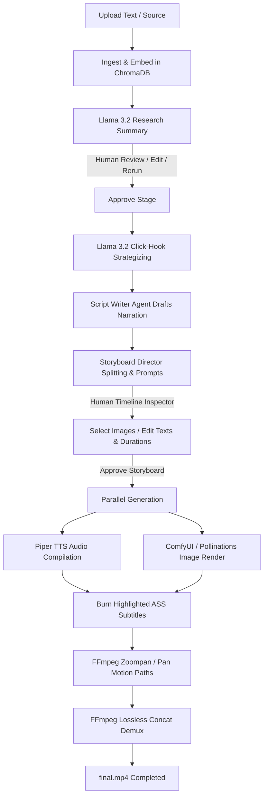

# 🌊 OwnWave Studio — Local AI Video Production Workstation

<p align="center">
  
</p>

<p align="center">
  <strong>Unleash independent creativity, storytelling, and imagination through visual motion and AI-powered local production.</strong>
</p>

<p align="center">
  <a href="#key-capabilities">Features</a> •
  <a href="#technical-architecture">Architecture</a> •
  <a href="#local-dependencies-setup">Setup Guide</a> •
  <a href="#running-the-application">Execution</a> •
  <a href="#the-content-pipeline">Pipeline Workflow</a>
</p>

---

**OwnWave Studio** is a production-grade, local-first, zero-API-cost automated video creation workstation. It orchestrates local AI models (Llama 3.2 3B, SDXL Turbo, Piper TTS) using a structured **LangGraph** state machine and event-driven asyncio background runners. It automatically researches topics, writes hooks, drafts narrator scripts, designs visual storyboards, compiles custom voice narrations, applies camera motion filters, burns word-by-word highlighted captions, and renders final high-resolution vertical/horizontal videos.

---

## 🚀 Key Capabilities

### 1. Dynamic Narrative & Hook Optimization
*   **Curiosity Loops**: Orchestrates LLM nodes to structure scripts with a powerful **3-second attention-grabbing hook**, a suspenseful narrative arc, and a values-aligned engagement Call to Action (CTA).
*   **Target Duration Formatting**: Automatically scales scene count and narration word counts based on your target video duration (**30s**, **1m**, **1m30s**, **3m**).

### 2. Premium Multi-Voice TTS Engine
*   **Dynamic Voice Library**: Features button choice selections in the UI for three voice configurations:
    1.  **English Female (Default)**: Rhasspy Lessac model (`en_US-lessac-medium`).
    2.  **English Male Narrator**: Cinematic documentary voice model (`en_US-ryan-medium`).
    3.  **Hindi-Hinglish Male Narrator**: Conversational Indian storyteller model (`hi_IN-rohan-medium`).
*   **Hinglish Language Injection**: Toggling the Hindi voice automatically injects conversational Hinglish guidelines (*"Write in conversational Indian Hinglish, avoid pure Hindi..."*) directly into the strategy, script, and storyboard nodes.
*   **Dynamic Downloading**: The backend automatically fetches ONNX models and JSON configs dynamically from Hugging Face if they are not cached locally.

### 3. High-Res Cinematic Image Pipeline
*   **Dynamic Suffixing**: Automatically appends style suffixes containing cinematic parameters (*"Ultra cinematic scene, emotional atmosphere, dramatic lighting, volumetric fog..."*) to LLM prompts for visual consistency.
*   **Resilient Fallback Engine**: If ComfyUI is offline, the backend falls back to the public `Pollinations.ai` image queue, utilizing an **exponential backoff with jitter retry loop** (up to 5 attempts) and browser headers to bypass anonymous rate limits.
*   **Multi-Seed Toggling**: Generates 2 visual alternatives per scene card. The UI allows the creator to click to select their preferred primary image slot.

### 4. Interactive Human-in-the-Loop Approvals
*   **Countdown Timers**: Seamless workflow page countdowns (5s for summary/script, 20s for storyboards) that auto-advance the pipeline.
*   **Live Editing**: Creators can click any block to pause the timer and manually edit narration text, image prompts, transition styles, and frame durations on the fly.
*   **Thread-Safe Global Cancellation**: A global cancellation controller terminates all active asyncio sub-tasks and terminates child FFmpeg or TTS CLI subprocesses, instantly cleaning up the pipeline state.

### 5. Advanced Subtitles & Motion Effects
*   **Word-by-Word Highlighted Subtitles**: Burns karaoke-style captions directly into the video canvas using ASS subtitle files. The spoken word highlights in **Gold/Yellow** (`&H00D7FF&`) while the remaining text is shown in White.
*   **Dynamic Motion Paths**: Programmatically applies camera motion to static images depending on their timeline index:
    *   *Scene 0 (Hook)*: Slow push-in zoom filter.
    *   *Scene 1*: Slow left-to-right horizontal pan.
    *   *Scene 2*: Slow pull-out zoom.
    *   *Scene 3*: Slow right-to-left horizontal pan.
*   **Silent Fallback wav**: Generates silences automatically if scene narration text is empty, preventing pipeline divide-by-zero crashes.

---

## 🛠 Technical Architecture

*   **Frontend**: Next.js 15, React, Framer Motion (micro-animations), Tailwind CSS v4, Lucide Icons.
*   **Backend**: FastAPI, SQLModel (reflected SQLite database migrations on startup).
*   **Orchestration**: LangGraph StateGraph DAG pipeline.
*   **Vector Database**: ChromaDB (persistent local SQLite collection).
*   **WebSockets**: Real-time server-sent console activity logging and progress streams.

---

## 📦 Local Dependencies Setup

### 1. Install & Pull Ollama Models
Install [Ollama](https://ollama.com/) locally. Once running, pull the Llama 3.2 3B model:
```bash
ollama pull llama3.2:3b
```

### 2. ComfyUI Setup (Optional Image Generator)
If you wish to render images locally:
1. Clone [ComfyUI](https://github.com/comfyanonymous/ComfyUI).
2. Download the [SDXL Turbo Checkpoint](https://huggingface.co/stabilityai/sdxl-turbo/resolve/main/sd_xl_turbo_1.0_fp16.safetensors) and save it inside `ComfyUI/models/checkpoints/`.
3. Launch ComfyUI. (The backend defaults to listening on `http://127.0.0.1:8188`).
*Note: If ComfyUI is closed, the backend automatically redirects all image queries to the online Pollinations fallback engine.*

### 3. FFmpeg & Piper CLI
*   **FFmpeg**: Ensure `ffmpeg` and `ffprobe` are installed on your OS and added to your system `PATH`.
*   **Piper TTS**: Ensure the `piper` executable is added to your environment `PATH` (or configured inside `backend/app/core/config.py`).
    *   *Windows users*: Download the standalone binary zip from Rhasspy, extract it, and add the path to your PATH environment variable.

---

## 💻 Running the Application

### 1. Start the FastAPI Backend
Navigate to the `backend` folder, set up a Python virtual environment, install requirements, and run:
```bash
# Enter backend directory
cd backend

# Create virtual environment
python -m venv venv
source venv/bin/activate  # On macOS/Linux
venv\Scripts\activate     # On Windows (PowerShell)

# Install backend dependencies
pip install -r requirements.txt

# Start backend server
python -m uvicorn app.main:app --reload
```
The FastAPI API documentation will be available at `http://127.0.0.1:8000/docs`.

### 2. Start the Next.js Frontend
Navigate to the `frontend` folder, install npm packages, and start the local development server:
```bash
# Enter frontend directory
cd ../frontend

# Install dependencies
npm install

# Start Next.js development server
npm run dev
```
Open `http://localhost:3000` in your web browser.

---

## 🌊 The Content Pipeline



---

## 📝 License & Copyright

© 2026 **OwnWave Studio**. All rights reserved.  
Created with ❤️ by **Jishu**.
