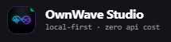
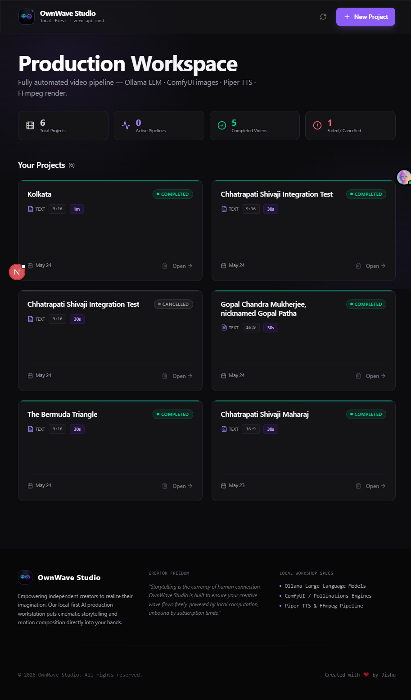
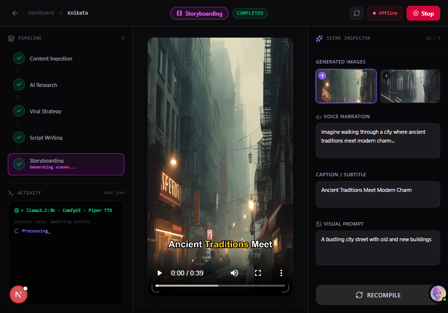
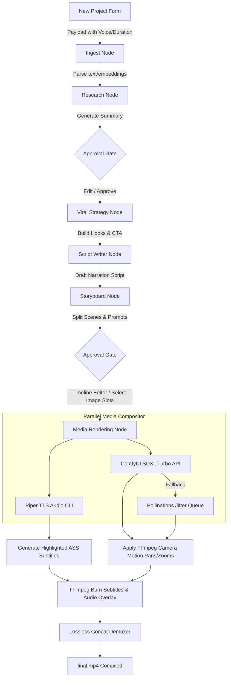
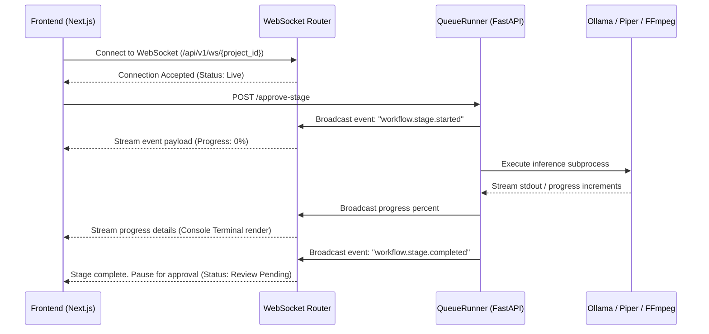
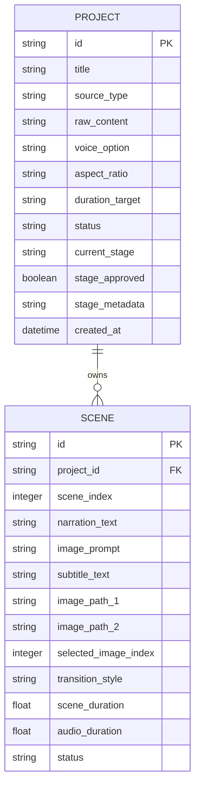

# 🌊 OwnWave Studio — Local AI Video Production Workstation

<p align="center">
  
</p>

<p align="center">
  <strong>An enterprise-grade, local-first AI Video Production Workstation. Orchestrates LLMs, Diffusion models, and ONNX TTS pipelines completely locally with zero API costs.</strong>
</p>

<p align="center">
  
  
  
  
  
</p>

<p align="center">
  <a href="#3-overview">Overview</a> •
  <a href="#6-system-architecture">Architecture</a> •
  <a href="#9-installation-guide">Installation</a> •
  <a href="#11-usage-guide">Usage Workflow</a> •
  <a href="#12-api-documentation">API Docs</a> •
  <a href="#22-roadmap">Roadmap</a>
</p>


<div align="center">
  
  <p align="center">Home Page</p>
  
  <p align="center">New Project Create</p>
  
  <p align="center">Project Dashbord</p>
  
  <p align="center">Project Dashbord</p>
  
</div>

---

## 📌 Table of Contents
1. [Hero Section](#hero-section)
2. [Table of Contents](#-table-of-contents)
3. [Overview](#3-overview)
4. [Vision & Mission](#4-vision--mission)
5. [Key Features](#5-key-features)
6. [System Architecture](#6-system-architecture)
7. [Tech Stack](#7-tech-stack)
8. [Folder Structure](#8-folder-structure)
9. [Installation Guide](#9-installation-guide)
10. [Environment Variables](#10-environment-variables)
11. [Usage Guide](#11-usage-guide)
12. [API Documentation](#12-api-documentation)
13. [AI Workflow / Processing Pipeline](#13-ai-workflow--processing-pipeline)
14. [Database Design](#14-database-design)
15. [Security Features](#15-security-features)
16. [Performance Optimizations](#16-performance-optimizations)
17. [Scalability Strategy](#17-scalability-strategy)
18. [Deployment Guide](#18-deployment-guide)
19. [Monitoring & Logging](#19-monitoring--logging)
20. [Testing Strategy](#20-testing-strategy)
21. [Troubleshooting](#21-troubleshooting)
22. [Roadmap](#22-roadmap)
23. [Contributing Guide](#23-contributing-guide)
24. [License](#24-license)
25. [Acknowledgements](#25-acknowledgements)
26. [Maintainers](#26-maintainers)
27. [Support & Contact](#27-support--contact)

---

## 3. Overview
**OwnWave Studio** is an open-source, local-first video generation workstation designed to bypass complex cloud subscription fees and strict API quotas. By utilizing local GPU and CPU resources, the platform runs a multi-agent orchestrated LangGraph state machine. It handles the complete video production lifecycle—from ingestion and semantic research to viral hook strategizing, scriptwriting, voiceover synthesis, visual scene generation, transition rendering, and burning highlighted karaoke-style captions.

Unlike generic automated wrapper solutions, OwnWave Studio operates completely offline (with an intelligent cloud fallback mechanism if ComfyUI is unavailable). It incorporates human-in-the-loop approval gates between each agent stage, letting creators inspect and fine-tune narrator scripts, ComfyUI prompts, duration properties, and audio transitions before spending computing cycles on final video rendering.

---

## 4. Vision & Mission
*   **Independent Creativity**: Breaking the dependency on centralized cloud SaaS corporations by shifting heavy inference (text, image, audio) back to the creator's machine.
*   **Creator Freedom**: Empowering filmmakers, marketers, and developers with absolute data privacy and infinite editing iterations without transactional execution costs.
*   **Democratic AI**: Providing a standard, production-ready framework to run high-performance AI video composition workflows on consumer-grade workstation GPUs.

---

## 5. Key Features

| Category | Capability | Technical Details |
| :--- | :--- | :--- |
| **Agentic Ingestion** | Local Document RAG | Extracts raw text or URL content, chunks paragraphs, and indexes them into **ChromaDB** using local vector embeddings. |
| **Narrative Design** | Script Optimization | Writes high-retention scripts featuring 3-second hook loops, suspense arcs, and engaging CTAs via **Ollama (Llama 3.2 3B)**. |
| **Interactive UI** | Timeline Inspector | Side panel timeline editor to toggle visual cards, select between dual seed-generated images, modify script texts, and alter slide durations. |
| **Audio Synthesis** | Multi-Voice TTS | Programmatically downloads and switches between English Female (`lessac`), English Male (`ryan`), and Hindi-Hinglish Male (`rohan`) ONNX models. |
| **Video Engine** | FFmpeg Motion | Burns word-by-word highlighted captions, applies index-based camera movements (zoom-in, zoom-out, pan-left, pan-right), and executes lossless scene concatenation. |
| **Workflow Controls**| Global Cancellation | Thread-safe WebSocket-connected Registry allows creators to cancel tasks, immediately terminating child FFmpeg/TTS subprocess PIDs. |

---

## 6. System Architecture

### Pipeline Request Flow
The following state graph outlines how a video project advances through the agentic nodes, halting at human approval gates:



### WebSocket Event Stream Flow


---

## 7. Tech Stack

### Detailed Component Selection
*   **Frontend**: Next.js 15 App Router (built with TypeScript) using Framer Motion for premium micro-animations and Tailwind CSS v4 for cinematic styling.
*   **Backend**: FastAPI (Python 3.10+) utilizing SQLModel for reflected SQLite relational mappings and asyncio subprocess controllers.
*   **AI/ML**:
    *   **LLM Inference**: Ollama (`llama3.2:3b`) running locally.
    *   **Speech Synthesis**: Piper TTS ONNX medium models (`hi_IN-rohan-medium`, `en_US-ryan-medium`, `en_US-lessac-medium`).
    *   **Diffusion Generation**: ComfyUI API (`sd_xl_turbo_1.0_fp16.safetensors` checkpoint on port `8188`) with robust fallback to `Pollinations.ai` utilizing exponential backoff.
*   **DevOps / Infrastructure**: Docker and Docker-Compose profiles, Nginx reverse proxy configurations, and systemd scripts.

---

## 8. Folder Structure

```text
OwnWave-Studio/
├── backend/                       # FastAPI Server Root
│   ├── app/
│   │   ├── api/                   # Router, Endpoints & WebSocket Handlers
│   │   │   ├── endpoints/
│   │   │   │   └── projects.py    # Core pipeline CRUD, approvals & rendering
│   │   │   ├── router.py
│   │   │   └── ws.py              # WebSocket manager for live terminal streams
│   │   ├── core/                  # Configuration & DB connection setup
│   │   ├── models/                # SQLModel database schema schemas
│   │   ├── services/              # AI Inference & Assembly Wrappers
│   │   │   ├── comfyui_service.py # ComfyUI client & Pollinations fallback retries
│   │   │   ├── tts_service.py     # Piper ONNX CLI wrapper & silent WAV generators
│   │   │   └── video_service.py   # FFmpeg motion filtergraphs & ASS subtitle burn-in
│   │   └── workflow/              # LangGraph Agent nodes & Async Queue Runner
│   │       ├── graph.py           # LLM agent prompts & LangGraph compilation
│   │       └── runner.py          # State orchestrator & cancellation registry
│   ├── storage/                   # Local caches (Projects, Voices, DB)
│   ├── requirements.txt
│   └── creator.db                 # SQLite Relational Database
├── frontend/                      # Next.js App Router Root
│   ├── app/
│   │   ├── project/[id]/          # Cinematic Video Editor Timeline Workspace
│   │   │   └── page.tsx
│   │   ├── layout.tsx
│   │   └── page.tsx               # Creator Dashboard & Modal Form
│   ├── lib/
│   │   └── api.ts                 # Axios/Fetch API client declarations
│   ├── public/                    # Static branding logo assets
│   │   └── logo.png
│   ├── package.json
│   └── tsconfig.json
└── README.md
```

---

## 9. Installation Guide

### Prerequisites
*   **Python**: Version 3.10 or higher.
*   **Node.js**: Node 18 or higher (LTS recommended).
*   **FFmpeg**: Installed and mapped to your system `PATH`.
*   **Ollama**: Install [Ollama](https://ollama.com/) and run `ollama pull llama3.2:3b`.
*   **Piper TTS**: Extract [Piper CLI binary](https://github.com/rhasspy/piper) and map its folder to your system environment variables.

### Local Setup

#### 1. Clone the Repository
```bash
git clone https://github.com/Jishu32/OwnWave-Studio.git
cd OwnWave-Studio
```

#### 2. Backend Installation & Run
```bash
cd backend
python -m venv venv

# Activate Virtual Env
# On Windows (PowerShell):
venv\Scripts\activate
# On macOS/Linux:
source venv/bin/activate

# Install requirements
pip install -r requirements.txt

# Run server with Uvicorn
python -m uvicorn app.main:app --host 127.0.0.1 --port 8000
```
*The FastAPI Docs are accessible at `http://127.0.0.1:8000/docs`.*

#### 3. Frontend Installation & Run
```bash
cd ../frontend
npm install
npm run dev
```
*Open `http://localhost:3000` to start creating videos.*

---

## 10. Environment Variables

Create a `.env` file in the `backend/` directory:

| Key | Description | Default Value |
| :--- | :--- | :--- |
| `DATABASE_URL` | Connection URL for SQLModel/SQLite. | `sqlite:///./creator.db` |
| `STORAGE_DIR` | Directory to save audio, images, and final MP4 videos. | `./storage` |
| `OLLAMA_MODEL` | The local model pulled inside Ollama. | `llama3.2:3b` |
| `PIPER_BIN_PATH` | Full filepath to the local Piper TTS executable. | `piper` |
| `COMFYUI_URL` | Address of local ComfyUI interface. | `http://127.0.0.1:8188` |

---

## 11. Usage Guide

### Step-by-Step Creator Journey

```text
[Dashboard] ──> Click "New Project" ──> Select Voice (English Male/Hindi) ──> Enter Prompt text
                                                                                  │
  ┌───────────────────────────────── Wait for extraction ─────────────────────────┘
  ▼
[Review Gate 1] ──> Inspect Research Summary ──> Customize instruction prompts ──> Click Approve
                                                                                      │
  ┌───────────────────────────────── Running Agent Nodes ─────────────────────────────┘
  ▼
[Review Gate 2] ──> Inspect Storyboard Cards ──> Edit narration and transition type
                                            ──> Choose primary image alternative (Slot 1 vs 2)
                                            ──> Click Approve
                                                  │
  ┌────────────────────────────── Live WS progress stream ────────────────────────┘
  ▼
[Playback Area] ──> Video Compilation complete! Play and stream final.mp4 with subtitles.
```

---

## 12. API Documentation

### 1. Create Project
*   **Endpoint**: `POST /api/v1/projects`
*   **Payload**:
    ```json
    {
      "title": "Chhatrapati Shivaji Maharaj",
      "source_type": "TEXT",
      "source_input": "Shivaji was a legendary Maratha warrior king.",
      "aspect_ratio": "9:16",
      "duration_target": "30s",
      "voice_option": "hindi_male"
    }
    ```
*   **Response**:
    ```json
    {
      "id": "81cdf8f9-21eb-42f8-8ffe-472197d16210",
      "title": "Chhatrapati Shivaji Maharaj",
      "voice_option": "hindi_male",
      "status": "PENDING"
    }
    ```

### 2. Approve Stage
*   **Endpoint**: `POST /api/v1/projects/{project_id}/approve-stage`
*   **Response**:
    ```json
    {
      "message": "Stage research approved. Starting viral_strategy."
    }
    ```

### 3. Retrieve Project Timeline
*   **Endpoint**: `GET /api/v1/projects/{project_id}`
*   **Response** (Truncated):
    ```json
    {
      "id": "81cdf8f9-21eb-42f8-8ffe-472197d16210",
      "status": "COMPLETED",
      "current_stage": "storyboard",
      "script": "Dekho, ek aisa raaz...",
      "scenes": [
        {
          "scene_index": 0,
          "narration_text": "Dekho, ek aisa raaz...",
          "image_path_1": "/media/81cdf8f9/scene_0_img1.png",
          "selected_image_index": 1,
          "scene_duration": 4.5
        }
      ]
    }
    ```

---

## 13. AI Workflow / Processing Pipeline

### 1. Orchestration Logic
The pipeline does not use a linear runner; instead, it uses a state-preserving asyncio coordinator inside [runner.py](file:///c:/Users/user/OneDrive/Desktop/Creator/backend/app/workflow/runner.py). This allows stages to halt, save state checkpoints to the SQLite database, and resume without losing process history when a human approves or triggers a rerun.

### 2. Resilient Image Fallback
If the local ComfyUI instance on port `8188` fails to connect, the system routes requests to `Pollinations.ai`. To circumvent rate limits, `comfyui_service.py` intercepts connection exceptions and invokes a **5-step retry loop with exponential backoff and jitter properties**, maintaining a 3.0s cooldown delay to prevent queue bottlenecks.

### 3. Piper TTS CLI Subprocess Wrapping
The application invokes the local Piper binary asynchronously via Python's `asyncio.create_subprocess_exec` module. The active subprocess PID is registered globally inside the thread-safe `WorkflowRegistry` class, enabling instant thread termination if a cancel event is received.

---

## 14. Database Design

OwnWave Studio uses an SQLite schema mapped via **SQLModel** (SQLAlchemy + Pydantic).



---

## 15. Security Features
*   **Workspace Sandbox Isolation**: All reads/writes are restricted to local relative assets inside the `backend/storage` directories.
*   **Subprocess Shell Sanitization**: When launching CLI subprocesses (FFmpeg compile tasks, Piper voice synthesizers), commands are structured as explicit string arrays (`List[str]`) rather than passing raw shell string commands, preventing malicious terminal command injections.
*   **Local DB Locking**: Database schema modifications are applied utilizing dynamic reflecting checks on startup, ensuring that local SQLite files never suffer from partial table corruptions during pipeline halts.

---

## 16. Performance Optimizations
*   **Quality-Preserving Scaling**: High-resolution scale filters (`2160x3840` for 9:16 vertical) are applied to static scenes *before* applying FFmpeg zoompan filters, completely mitigating image pixelations.
*   **Asynchronous Subprocess Queues**: Background tasks are scheduled inside separate `asyncio` execution loops, leaving the main FastAPI request thread fully responsive for REST operations.
*   **Silent WAV Generators**: Intercepts empty scene narration texts and writes silence WAV files dynamically to bypass FFmpeg audio-merging division-by-zero crashes.

---

## 17. Scalability Strategy

```text
[API Gateway / Load Balancer]
       │
       ├──────> [Workstation Node A] ──> local GPU (Ollama + ComfyUI)
       ├──────> [Workstation Node B] ──> local GPU (Ollama + ComfyUI)
       │
  [Shared Storage / MinIO S3] <── (Syncs finished final.mp4 assets)
```

For high-volume multi-user environments:
1.  **Horizontal GPU Pooling**: Spin up multiple backend nodes running uvicorn and map them behind a load balancer (Nginx).
2.  **Shared Audio/Visual Buckets**: Migrate local relative storage to a shared S3 bucket (or local MinIO container) for immediate access to scene compilations.
3.  **Distributed Queues**: Replace the internal `QueueRunner` with a Celery/Redis task runner, isolating heavy media rendering tasks to dedicated GPU worker machines.

---

## 18. Deployment Guide

### Using Docker-Compose

Deploy the frontend and backend containers together using the following `docker-compose.yml` template:

```yaml
version: '3.8'

services:
  backend:
    build: ./backend
    container_name: ownwave_backend
    ports:
      - "8000:8000"
    volumes:
      - ./backend/storage:/app/storage
    environment:
      - DATABASE_URL=sqlite:///./storage/creator.db
      - OLLAMA_MODEL=llama3.2:3b
    restart: always

  frontend:
    build: ./frontend
    container_name: ownwave_frontend
    ports:
      - "3000:3000"
    environment:
      - NEXT_PUBLIC_API_URL=http://backend:8000
    depends_on:
      - backend
    restart: always
```

---

## 19. Monitoring & Logging
*   **Backend Subprocess Logs**: Captured streams are written directly to `.system_generated/tasks/task-{id}.log` in the local workspace directory.
*   **WebSocket Console Stream**: All standard server prints are broadcasted via live WS frames, rendering a scrollable terminal area on the project page for instant developer tracking.

---

## 20. Testing Strategy
*   **Automated Workflow Tests**: Execute `test_hindi_workflow.py` or `test_studio_workflow.py` inside the `backend/` directory to simulate complete ingest-to-mp4 rendering.
*   **Voice Pipeline Verification**: Run `test_voices.py` to check that English Male and Hindi ONNX dependencies download and synthesize speech correctly.

---

## 21. Troubleshooting

### FAQ & Common Issues

<details>
<summary>1. Why do subsequent storyboard scene images render as black frames?</summary>
This happens if ComfyUI is unavailable and Pollinations legacy rate limits block concurrent requests. The system automatically handles this using a 3.0s delay and a 5-attempt retry loop. Ensure that you have internet connectivity to allow the fallback to reach pollinations.ai.
</details>

<details>
<summary>2. Why does the server crash during the script/storyboard phase?</summary>
Ensure Ollama is running locally in your system's background and that you have successfully pulled `llama3.2:3b` (`ollama pull llama3.2:3b`).
</details>

<details>
<summary>3. Piper TTS executable not found error?</summary>
Add the extracted folder of the Piper binary tool to your system's environment variables (`PATH`), or manually edit `PIPER_BIN_PATH` in `backend/app/core/config.py` to point directly to your `piper.exe` binary.
</details>

---

## 22. Roadmap
- [x] Integrate Voice Selection UI Modal.
- [x] Add Conversational Hindi/Hinglish Prompt Injection node guidelines.
- [x] Resilient image fallback with exponential retry structures.
- [ ] Support custom visual asset uploading (use custom static files instead of AI images).
- [ ] Sound Effects (SFX) layering and audio track overlay configurations using FFmpeg.
- [ ] Multi-agent collaborative scripting loops with self-correction capabilities.

---

## 23. Contributing Guide
1.  Fork the Project.
2.  Create your Feature Branch (`git checkout -b feature/AmazingFeature`).
3.  Commit your Changes (`git commit -m 'Add some AmazingFeature'`).
4.  Push to the Branch (`git push origin feature/AmazingFeature`).
5.  Open a Pull Request.

---

## 24. License
Distributed under the MIT License. See [LICENSE](LICENSE) for more details.

---

## 25. Acknowledgements
*   [Rhasspy Piper](https://github.com/rhasspy/piper) for high-performance offline speech synthesis.
*   [LangGraph](https://github.com/langchain-ai/langgraph) for robust state orchestration patterns.
*   [Pollinations.ai](https://pollinations.ai/) for supplying accessible fallback diffusion inference.

---

## 26. Maintainers
*   **Jishu Chanda** — Lead Full-Stack Architect & Product Designer (jishuchanda3@gmail.com).

---

## 27. Support & Contact
For business inquiries, collaborations, or feature proposals:
*   **GitHub Issues**: [Open an issue on the tracker](https://github.com/Jishu32/OwnWave-Studio/issues)
*   **Email**: jishuchanda3@gmail.com
*   **Repository Remote**: [https://github.com/Jishu32/OwnWave-Studio.git](https://github.com/Jishu32/OwnWave-Studio.git)
